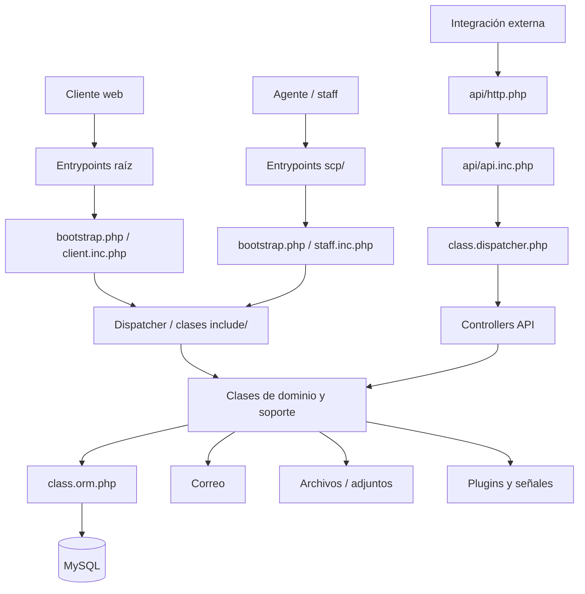
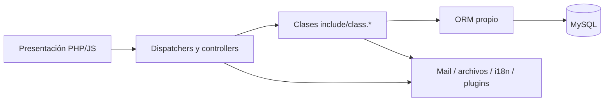

# Arquitectura

## 1. Clasificación

**Inferencia sustentada:** IRIS es un **monolito PHP modular basado en osTicket**. No se identifica una arquitectura de microservicios ni una separación estricta en capas independientes.

Evidencia principal:

- `bootstrap.php`: inicialización global, configuración, conexión a BD, constantes de tablas y carga de clases base.
- `api/http.php`: dispatcher de API HTTP.
- `ajax.php`: dispatcher AJAX de interfaz cliente.
- `scp/ajax.php`: dispatcher AJAX de consola de personal.
- `include/class.orm.php`: ORM propio.
- `include/class.ticket.php`: modelo/comportamiento de tickets.
- `include/client/` y `include/staff/`: plantillas/interfaz.

## 2. Capas reales identificadas

### 2.1 Entrada y presentación

**Comprobado.** Existen scripts de entrada PHP y plantillas diferenciadas para cliente y personal. `ajax.php` carga `client.inc.php`; `scp/ajax.php` carga `staff.inc.php`.

Responsabilidades observadas:

- inicio de solicitud;
- creación/consulta de tickets;
- autenticación de cliente o staff;
- renderizado de plantillas;
- AJAX para formularios, borradores, usuarios, tickets, tareas, reportes y configuración.

### 2.2 Enrutamiento/controladores

**Comprobado.** `include/class.dispatcher.php` se utiliza para registrar y resolver patrones de URL. `api/http.php`, `ajax.php` y `scp/ajax.php` construyen árboles de rutas con `patterns()`, `url()`, `url_get()`, `url_post()` y `url_delete()`.

Ejemplos reales:

- `POST /api/http.php/tickets.json` → `TicketApiController::create`.
- `POST /api/http.php/tasks/cron` → `CronApiController::execute`.
- rutas cliente AJAX para `draft`, `form` e `i18n`.
- rutas staff AJAX para tickets, usuarios, organizaciones, tareas, reportes, formularios y configuración.

### 2.3 Dominio y lógica de negocio

**Comprobado.** La lógica se concentra en clases `include/class.*.php` y controladores `include/api.*.php` / `include/ajax.*.php`.

Módulos relevantes encontrados por constantes de tablas y clases/rutas:

- tickets;
- usuarios y cuentas;
- organizaciones;
- staff/agentes;
- departamentos, roles y equipos;
- threads/hilos y eventos;
- tareas;
- formularios dinámicos;
- SLA;
- temas de ayuda;
- FAQ/base de conocimiento;
- correo y plantillas;
- filtros;
- plugins;
- colas y búsquedas;
- schedules;
- archivos y adjuntos;
- reportes.

### 2.4 Persistencia

**Comprobado.** `include/class.orm.php` implementa un ORM propio que declara metadatos `pk`, `table`, `joins`, `foreign_keys`, `ordering`, `defer` y `select_related`. El propio comentario del archivo lo describe como un ORM simple inspirado en Django.

La conexión se realiza en `Bootstrap::connect()` usando `DBHOST`, `DBUSER`, `DBPASS` y `DBNAME`. El bootstrap permite además opciones SSL si están definidas.

### 2.5 Infraestructura transversal

**Comprobado:**

- `include/class.http.php`: utilidades HTTP.
- `include/class.auth.php`: autenticación.
- `include/class.crypto.php`: utilidades criptográficas.
- `include/class.signal.php`: señalización/extensibilidad.
- `include/class.queue.php`: colas/vistas.
- `include/class.i18n.php`: internacionalización.
- `include/mysqli.php`: acceso MySQL.
- `include/mpdf/`: PDF.
- `include/laminas-mail/`: correo.
- `include/pear/`: librerías heredadas.

## 3. Comunicación entre módulos

**Inferencia sustentada:** la comunicación es principalmente **in-process**. Los scripts de entrada cargan el bootstrap y clases PHP en el mismo proceso. El ORM accede directamente a la base de datos; no existe evidencia de un bus de servicios interno independiente.

También existe extensibilidad mediante `Signal::send(...)`. `api/http.php` emite `Signal::send('api', $dispatcher)` y las superficies AJAX emiten señales equivalentes para permitir registro/extensión de rutas.

## 4. Patrones identificados

### Dispatcher / Front Controller parcial

`api/http.php`, `ajax.php` y `scp/ajax.php` centralizan resolución de rutas de sus respectivas superficies.

### Active Record / Data Mapper híbrido

**Inferencia.** Las clases de dominio declaran metadatos de tabla y relaciones consumidos por `class.orm.php`. Funcionalmente se acerca a un Active Record enriquecido por un mapper genérico.

### Observer / Signal

`Signal::send()` permite notificar extensiones y registrar comportamiento desacoplado.

### Plugin

La existencia de `PLUGIN_TABLE`, `PLUGIN_INSTANCE_TABLE` y rutas de administración de plugins confirma un subsistema de plugins.

## 5. Dependencias entre capas

La dirección anterior representa el flujo predominante, no una regla arquitectónica formal. El código heredado permite dependencias cruzadas y acceso a utilidades globales.

## 6. Separación de responsabilidades

### Comportamiento comprobado

- Bootstrap concentra configuración, conexión, carga de código y definición global de tablas.
- Los modelos dependen del ORM.
- Los controladores API/AJAX llaman directamente a clases del núcleo.

### Posible violación

**Inferencia:** la ausencia de una capa de aplicación/servicios claramente delimitada provoca mezcla de validación, reglas de negocio, persistencia y respuesta HTTP en algunos flujos.

### Recomendación

No reestructurar el monolito de forma masiva. Primero caracterizar flujos críticos mediante pruebas y aislar nuevas personalizaciones en módulos/clases propias, manteniendo compatibilidad con el mecanismo de plugins/señales cuando sea posible.
