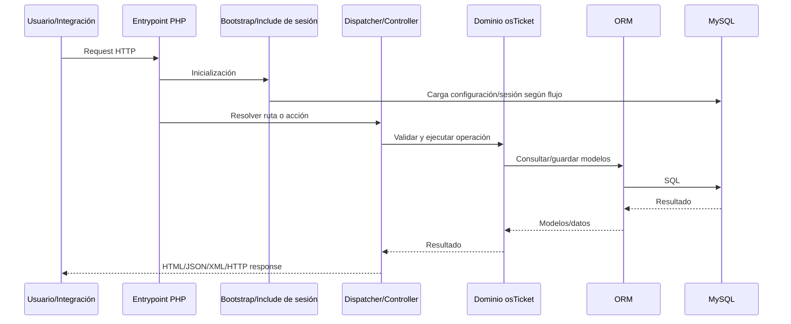
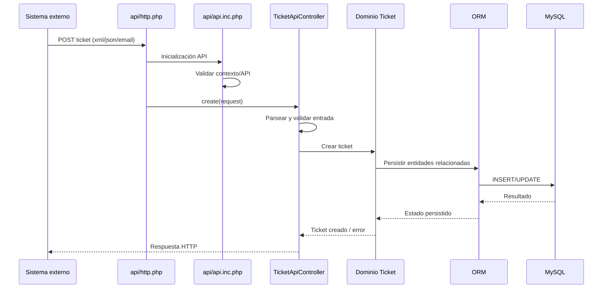
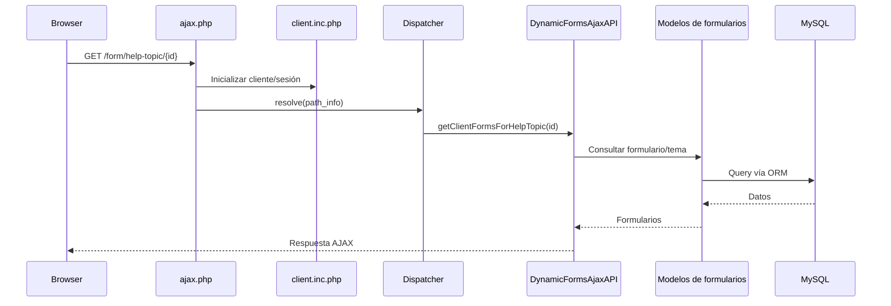
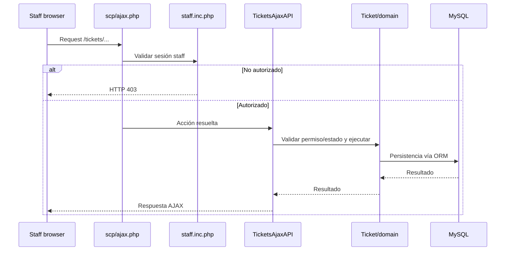

# Flujos de aplicación

## 1. Flujo general

Este diagrama representa el patrón predominante; las páginas heredadas pueden combinar pasos en un mismo script.

## 2. Creación de ticket mediante API

### Punto de entrada

`api/http.php` registra:

`POST /tickets.{xml|json|email}` → `TicketApiController::create`.

### Flujo

### Validaciones

**Comprobado:** el controlador de tickets y la infraestructura API realizan validación antes de crear el ticket. Los campos concretos dependen del formato y de formularios/configuración activa.

### Persistencia

Involucra al menos la entidad ticket y estructuras relacionadas de formulario/thread conforme a la lógica osTicket. No se fija aquí una lista inmutable de INSERTs porque puede variar con configuración, formularios y plugins.

## 3. Operación AJAX del cliente

Ejemplo: obtención de formularios para un tema de ayuda.

## 4. Operación AJAX de staff sobre tickets

`scp/ajax.php` registra numerosas operaciones sobre `/tickets/`, incluyendo preview, status, tareas, búsqueda, transferencia, asignación, referidos, campos y exportación.

## 5. Cron vía API

`POST /tasks/cron` → `CronApiController::execute`.

**Inferencia sustentada:** permite disparar procesamiento periódico desde una llamada HTTP autenticada/configurada, en lugar de depender exclusivamente de ejecución local.

## 6. Inicialización de aplicación

`bootstrap.php` realiza, entre otras, las siguientes tareas comprobadas:

1. ajusta opciones de PHP;
2. configura timezone UTC;
3. define rutas internas;
4. declara versión `1.18-git`;
5. carga configuración local;
6. define constantes de tablas según prefijo;
7. conecta a BD;
8. carga clases base;
9. prepara i18n.

El orden preciso completo debe consultarse en `Bootstrap::init()`.

## 7. Errores fatales

`Bootstrap::croak()`:

1. construye un mensaje con la página actual;
2. intenta enviar alerta mediante `osTicket\Mail\Mailer::sendmail`;
3. devuelve HTTP 500 con mensaje genérico al usuario.

Esto evita exponer el detalle del error en esa ruta concreta, aunque el estado global de `display_errors` se analiza como hallazgo separado.
