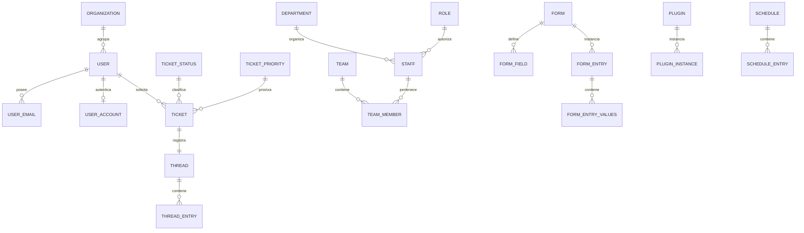

# Modelos y datos

## Persistencia

**Comprobado:** el proyecto utiliza una base de datos relacional MySQL/MariaDB compatible.

Evidencia:

- `setup/inc/streams/core/install-mysql.sql` contiene el esquema inicial.
- `include/mysqli.php` implementa acceso mediante MySQLi.
- `Bootstrap::connect()` en `bootstrap.php` usa `DBHOST`, `DBUSER`, `DBPASS`, `DBNAME` y soporte opcional SSL.

## ORM

`include/class.orm.php` define un ORM propio “Simple ORM” inspirado en Django. Su metamodelo reconoce:

- `pk`;
- `table`;
- `defer`;
- `select_related`;
- `view`;
- `joins`;
- `foreign_keys`;
- `ordering`.

Las relaciones se compilan a partir de `joins` y constraints declarados por los modelos.

## Inventario de familias de tablas

`Bootstrap::defineTables()` declara explícitamente las siguientes tablas lógicas, prefijadas en tiempo de ejecución con el `TABLE_PREFIX` configurado:

### Sistema

- `syslog`
- `session`
- `config`
- `sequence`
- `translation`
- `timezone`

### Contenido y archivos

- `canned_response`
- `content`
- `file`
- `file_chunk`
- `attachment`
- `note`

### Usuarios y organizaciones

- `user`
- `user__cdata`
- `user_email`
- `user_account`
- `organization`
- `organization__cdata`

### Staff y autorización organizativa

- `staff`
- `team`
- `team_member`
- `department`
- `staff_dept_access`
- `role`

### Knowledge base

- `faq`
- `faq_topic`
- `faq_category`

### Tickets, threads y tareas

- `draft`
- `thread`
- `thread_entry`
- `thread_entry_email`
- `thread_entry_merge`
- `lock`
- `ticket`
- `ticket__cdata`
- `thread_event`
- `thread_referral`
- `thread_collaborator`
- `ticket_status`
- `ticket_priority`
- `event`
- `task`
- `task__cdata`

### Formularios y listas

- `form`
- `form_field`
- `list`
- `list_items`
- `form_entry`
- `form_entry_values`
- `help_topic`
- `help_topic_form`
- `sla`

### Correo

- `email`
- `email_account`
- `email_template_group`
- `email_template`

### Automatización y extensibilidad

- `filter`
- `filter_rule`
- `filter_action`
- `plugin`
- `plugin_instance`
- `schedule`
- `schedule_entry`
- `api_key`

### Colas y vistas

- `queue`
- `queue_column`
- `queue_columns`
- `queue_sort`
- `queue_sorts`
- `queue_export`
- `queue_config`

## Modelos de dominio relevantes

### Ticket

**Archivo:** `include/class.ticket.php`  
**Propósito:** representa el ticket y concentra comportamiento relacionado con su ciclo de vida.

**Comprobado:** está integrado con el ORM y el resto del dominio osTicket. El controlador `include/api.tickets.php` utiliza esta lógica para crear tickets a partir de solicitudes externas.

No se duplican aquí todos sus métodos y campos porque el modelo es extenso; el esquema SQL es la fuente primaria para columnas físicas y la metadata del modelo para relaciones lógicas.

### Usuario / cuenta / correo

**Evidencia:** tablas `user`, `user_email`, `user_account`, archivos de clase y rutas `scp/ajax.php` bajo `/users`.

El modelo distingue usuario, direcciones de correo y cuenta autenticable. Existe además `user__cdata` para datos dinámicos/materializados.

### Organización

**Evidencia:** `organization`, `organization__cdata` y rutas `/orgs` en `scp/ajax.php`.

### Staff, departamentos, roles y equipos

**Evidencia:** `staff`, `department`, `role`, `team`, `team_member`, `staff_dept_access`.

Estas estructuras soportan organización interna y autorización/visibilidad de agentes.

### Thread y Thread Entry

**Evidencia:** `thread`, `thread_entry`, `thread_entry_email`, `thread_entry_merge`, además de eventos, referidos y colaboradores.

**Inferencia sustentada:** ticket/tarea se apoyan en hilos para registrar mensajes, notas y actividad, patrón propio del dominio observado.

### Task

**Evidencia:** `task`, `task__cdata`, rutas `/tasks/` en staff AJAX y `/tasks/cron` en API HTTP.

### Formularios dinámicos

**Evidencia:** `form`, `form_field`, `form_entry`, `form_entry_values`, `help_topic_form`; controladores `ajax.forms.php`.

Los campos dinámicos explican la presencia de tablas `__cdata` materializadas para entidades principales.

## Relaciones conservadoras

El siguiente diagrama muestra únicamente relaciones conceptuales respaldadas por nombres de tablas, rutas y metadatos ORM. No pretende sustituir el esquema SQL completo.

**Advertencia:** para una migración o modificación de integridad referencial se debe revisar directamente `install-mysql.sql` y la metadata `$meta['joins']` de cada clase; no debe usarse este Mermaid como definición DDL.

## Claves, índices y restricciones

**Comprobado:** `setup/inc/streams/core/install-mysql.sql` define claves primarias, claves/índices y restricciones de columnas para las tablas iniciales.

**Importante:** osTicket expresa una parte de sus relaciones en metadata del ORM. Por ello, la ausencia de una `FOREIGN KEY` física en una tabla no puede interpretarse automáticamente como ausencia de relación de dominio.

## Migraciones / upgrades

**Comprobado:** existe `include/upgrader/`, lo que evidencia un mecanismo de evolución de esquema y aplicación.

No se equipara este mecanismo a herramientas externas como Flyway/Liquibase; el proyecto usa su propia infraestructura de actualización.

## DTOs y transformaciones

No se identificó una capa de DTOs formal separada con esa nomenclatura. En la API, las solicitudes XML/JSON/email se normalizan en los controladores y se transforman hacia las estructuras esperadas por el dominio de tickets.

**Inferencia:** la frontera API utiliza arrays/objetos PHP y validación interna en vez de DTOs fuertemente tipados separados.
